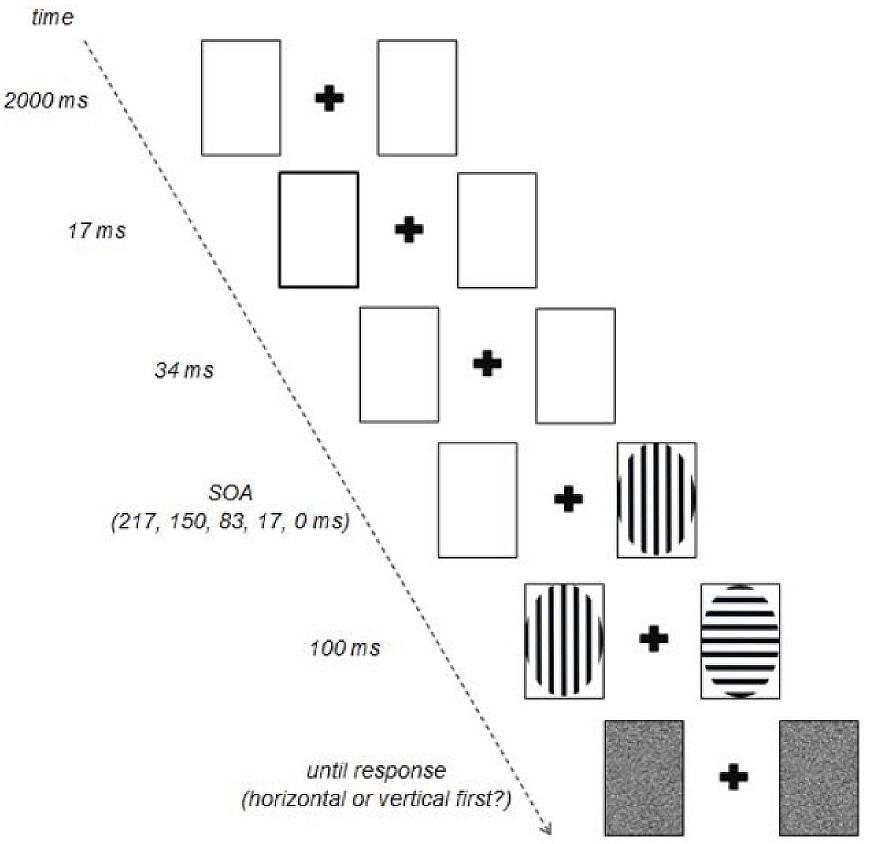
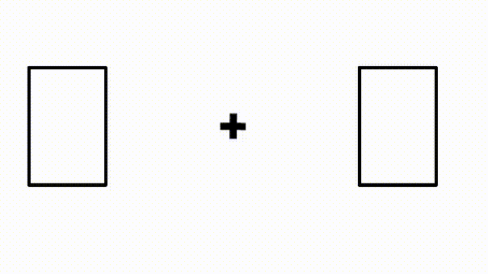

<!-- ##### add slider to code boxes ##### -->
<style>
pre {
  overflow-x: auto;
}
pre code {
  word-wrap: normal;
  white-space: pre;
}
</style>
<!-- #################################### -->

***
***

```{r setup, include = FALSE}

# install and load relevant packages
library(knitr)
library(kableExtra)
library(tidyverse)
library(plotly)
library(highcharter)

options(knitr.table.format = "html")

# This is a proof of concept, a horrible hybrid between RMarkdown and HTML syntax that has not been polished and optimized. My apologies for the inelegant code.

```

# Introduction

The replicability crisis (or [revolution](http://journals.sagepub.com/doi/full/10.1177/1745691615609918)) in psychology has led many reasearchers to re-evaluate and improve many aspects of how empirical studies are conducted. 

Some popular initiatives carried out in the latest years are:

* encouraging the [sharing](http://journals.sagepub.com/doi/full/10.1177/0956797617704015) of data, materials, and analysis protocols on public repositories
* [replication](http://journals.sagepub.com/doi/pdf/10.1177/1745691612460686) of published studies
* [pre-registrations](https://osf.io/2dxu5/) and [registered reports](https://www.theguardian.com/science/head-quarters/2014/may/20/psychology-registration-revolution)
* improving statistical literacy, e.g.:
    - addressing common [misinterpretations](https://aeon.co/essays/it-s-time-for-science-to-abandon-the-term-statistically-significant) of *p*-values
    - reducing the *p*-value [threshold](https://www.nature.com/articles/s41562-017-0189-z) for claiming statistical significance of new results
    - popularization of alternative ways to analyze data, e.g., emphasis on [effect sizes](http://journals.sagepub.com/doi/pdf/10.1177/0956797613504966), [multilevel modeling](http://www.bristol.ac.uk/cmm/learning/multilevel-models/), and [Bayes factors](https://www.sciencedirect.com/science/article/pii/S0022249615000723)
* promoting [international collaborations](https://psysciacc.org/) to facilitate the collection of larger datasets

However, the passage between data analysis and data communication is often not very transparent. In most cases, the reader does not know exactly how the authors reached a particular result starting from the raw data. In other words, there is a disconnection between the **creation** and the **dissemination** of the results of empirical studies.   
   
This is in part due to the traditional method of scientific publication, where research materials such as procedures, data, and analytic methods are *described* rather than *distributed*. Academic articles typically show only the final product of a complex process, and honest mistakes, questionable research practices, or deliberate fraud can occur at each step. Moreover, file formats typically used to publish academic articles online (i.e., *pdf*) were developed to mimic printed documents and therefore suffer similar limitations (i.e., they are static and non-transparent).

We propose an alternative way of disseminating knowledge<a href="#fn2"><sup>2</sup></a>. Inspired by the dynamic and interactive nature of online blogs, we use free and open-source software to create a form of scientific publication that is fully reproducible and inspectable<a href="#fn3"><sup>3</sup></a>.

## Authors and affiliations

Clicking on author names can open their personal website (click on my name) or send a direct email (click on Ian's name). Affiliations can be paired with their respective websites (see footnote).

## Inline references

<!-- ##### This ugly HTML code allows the reader to click on a reference     ##### -->
<!-- ##### and be teleported to the corresponding entry in the bibliography. ##### -->
<!-- ##### A better implementation would be to use a .css template.          ##### -->

Bibliographic references can be included in the text (<a href="#upper_1974">Upper (1974)</a>, <a href="#molloy_1983">Molloy (1983)</a>, <a href="#skinner_1985">Skinner et al. (1985)</a>, <a href="#skinner_1996">Skinner and Perlini (1996)</a>, <a href="#didden_2013">Didden et al. (2013)</a>; but see <a href="#hermann_1984">Hermann (1984)</a>; for reviews, see <a href="#olson_1984">Olson (1984)</a>, <a href="#mclean_2014">McLean and Thomas (2014)</a>).   

<!-- ##### This other ugly HTML code opens links in another tab.                           ##### -->
<!-- ##### Again, implementing this functionality in a .css template would be much better. ##### -->
   
Another possibility would be to directly link to the published version of each manuscript (<a href="http://journals.sagepub.com/doi/pdf/10.2466/pms.1984.58.2.350" target="_blank">Hermann (1984)</a>). This works better when journals are not behind a paywall (but see <a href="https://unpaywall.org/" target="_blank">here</a>; if you are one of those wretched rebels, see <a href="https://en.wikipedia.org/wiki/Sci-Hub" target="_blank">here</a> and <a href="https://www.reddit.com/r/scihub/comments/7ioo0m/working_scihub_domains_10122017/" target="_blank">here</a>).

# Method

Original data can be hosted on public repositories (e.g., [Open Science Framework](https://osf.io/), [figshare](https://figshare.com/), [Zenodo](https://zenodo.org/), [Dryad](https://www.datadryad.org/), ...) and downloaded from the document.   
   
For this example we will use the ```mpg``` dataset from  the ```ggplot2``` package, with fuel economy data from years `r unique(mpg$year)[1]` and `r unique(mpg$year)[2]` for `r length(unique(mpg$model))` popular models of car.

## Participants

A total number of `r length(unique(mpg$model))` car models participated in this study. None of them were harmed.   
   
Note that this summary is dynamically generated from the dataset. For example, the total number of cars is calculated with the following code: ``` length(unique(mpg$model)) ```. Any changes in the dataset would automatically be reflected in the report.

## Procedure


Lame jokes aside, the point here is the possibility to embed **videos** or **gifs** showing an example of the procedure, which can be more intuitive than displaying a static timeline of serial events.

```{r, fig.cap = '_**A static display.**_ Example from [here](https://osf.io/qek7v/).'}



```

```{r, fig.cap = '_**A dynamic display.**_ In this particular case, the timing here is not precise due to technical limitations, but the concept is clear. Example from [here](https://asch3tti.netlify.com/post/bayesatlund2018/).'}



```

## Measures

The ```mpg``` dataset includes the following variables:

* **`r names(mpg[1])`**: car manufacturer
* **`r names(mpg[2])`**: car model
* **`r names(mpg[3])`**: engine displacement (in litres)
* **`r names(mpg[4])`**: year of manufacture
* **`r names(mpg[5])`**: number of cylinders
* **`r names(mpg[6])`**: type of transmission
* **`r names(mpg[7])`**: *f* = front-wheel drive; *r* = rear wheel drive; *4* = 4wd
* **`r names(mpg[8])`**: city miles per gallon
* **`r names(mpg[9])`**: highway miles per gallon
* **`r names(mpg[10])`**: fuel type
* **`r names(mpg[11])`**: "type" of car

Again, variable names are not hard-coded but extracted from the dataset. 

_**DISCLAIMER**_: I know very little about cars. Please don't ask me what the above variables actually mean.

# Results

This is the section that would be maximally improved by adopting an augmented publishing approach.

## Tables

An example of inline tables. Here we display the first 6 rows of the ```mpg``` dataset.

```{r table}

kable(head(mpg)) %>%
  kable_styling(bootstrap_options = c("striped", "hover", "condensed"), full_width = FALSE)

```

## Graphs

One of the advantages of using a native online publication system is the possibility to create interactive plots, which would help exploring the data and are also more appealing to an audience of non-experts.   
   
Among the _**R**_ packages that help creating such graphs, see ```plotly``` and ```highcharter```.

```{r graph_plotly, message = FALSE, warning = FALSE, fig.cap = '_**Figure 1.**_ An interactive plot made with ```plotly```.'}

plot_ly(mpg,
  x = ~ cty,
  y = ~ displ,
  type = "scatter",
  text = paste("manufacturer: ", mpg$manufacturer),
  mode = "markers",
  color = ~ hwy,
  size = ~ hwy
)

```

```{r graph_highcharter, message = FALSE, warning = FALSE, fig.cap = '_**Figure 2.**_ An interactive plot made with ```highcharter```. Example taken from [here](https://cran.r-project.org/web/packages/highcharter/vignettes/charting-data-frames.html).'}

count(mpg, manufacturer, year) %>%
  hchart(., 
         "bar", 
         hcaes(x = manufacturer, 
               y = n, 
               group = year),
       color = c("#263ada", "#d3b421"),
       name = c("year 1999", "year 2008"))

```

```{r graph_treemap, message = FALSE, warning = FALSE, fig.cap = '_**Figure 3.**_ An interactive treemap made with ```highcharter```. Example taken from [here](https://cran.r-project.org/web/packages/highcharter/vignettes/charting-data-frames.html).'}

mpg %>%
  group_by(manufacturer) %>%
  summarise(
    n = n(),
    unique = length(unique(model))
  ) %>%
  arrange(-n, -unique) %>%
  hchart(
    .,
    "treemap",
    hcaes(
      x = manufacturer,
      value = n,
      color = unique
    )
  )

```

## Statistical results

As an example, let's run a simple regression to investigate the linear relationship between engine displacement (```displ```) and number of cylinders (```cyl```).

```{r R_regr}

regr.results <- summary(lm(displ ~ cyl, data = mpg))
regr.results

```

The cluttered output above can be simplified by including the relevant results directly in the text: 

>The number of cylinders significantly predicts engine displacement, $\beta$ = `r format(regr.results$coefficients[2], digits = 2)`, $t_{`r regr.results$df[2]`}$ = `r format(regr.results$coefficients[6], digits = 4)`, *p* < .001. The number of cylinders also explains a significant proportion of variance in engine displacement, *$\sf{R^2_{adj}}$* = `r format(regr.results$adj.r.squared, digits = 2)`, $F_{(`r regr.results$fstatistic[2]`, `r regr.results$fstatistic[3]`)}$ = `r format(regr.results$fstatistic[1], digits = 6)`, *p* < .001.

### Review the code

The code that generates plots and statistical results is hidden by default to improve readability. Interested reviewers and readers can inspect it easily by clicking on the **"Code"** button.

<!-- ##### As of today (May 31st, 2018), blogdown does not allow code folding in posts.  ##### -->
<!-- ##### A workaround can be found here:                                               ##### -->
<!-- ##### https://statnmap.com/2017-11-13-enable-code-folding-in-bookdown-and-blogdown/ ##### -->
<!-- ##### However, lack of time and skill prevented me                                  ##### -->
<!-- ##### from successfully implementing it in the blogdown version of this document.   ##### -->

### Communicate with other software

Analyses can also be run with other software but embedded and run from this document. Here is an example of ```python``` code:

```{python pyth_regr, eval = FALSE}

regr.fit(mpg_displ, mpg_cyl)

```

Supported programming languages can be found [here](https://rmarkdown.rstudio.com/authoring_knitr_engines.html).   
   
If researchers use other statistical software that does not directly interface with _**R**_ (e.g., **SPSS**), the corresponding syntax can be included as simple text. It will **not** dynamically generate the results (which would have to be inserted manually), but at least reviewers and readers would be able to inspect the code:

```{r SPSS_regr, eval = FALSE}

REGRESSION
/MISSING LISTWISE
/STATISTICS COEFF OUTS R ANOVA
/CRITERIA=PIN(.05) POUT(.10)
/NOORIGIN
/DEPENDENT displ
/METHOD=ENTER cyl.

```

# Discussion

To summarize, this augmented document:

* is directly linked to the raw data
* is universally accessible (as long as you have a browser, you can read its content)
* is clear to read and easy to navigate 
* is better than the “classical” *pdf*, because intrinsically dynamic and scalable
* can be used with different programming languages
* includes technical details that can be accessed without impairing the overall narrative, thanks to the hidden code (give readers a story, but also the possibility to check the details)

This document can be hosted on public repositories that assign a DOI (e.g., [Open Science Framework](https://osf.io/), [Zenodo](https://zenodo.org/)). To promote peer reviewing, the host would also have a comment section similar to what can be found on most blogs (e.g., [Disqus](https://disqus.com/)) and some preprint servers (e.g., [bioRxiv](https://www.biorxiv.org/)).   
   
An even better solution would be to integrate an online annotating system like [Hypothes.is](https://web.hypothes.is/) (an interesting discussion can be found [here](https://web.hypothes.is/blog/preprint-services-gather-to-explore-an-annotated-future/)). A promising collaboration between the Center for Open Science and Hypothes.is has recently been [announced](https://web.hypothes.is/blog/cos-launch/).

## Similar projects

Several projects (at various stages of development) share a similar idea of interactive scholarly publication:

* [Datazar Paper](https://www.datazar.com/paper) ([example](https://www.datazar.com/focus/f03b8705b-c0ba-454c-afa0-3a7729a6c96f))
* [Andrew York](https://twitter.com/AndrewGYork) developed an impressive [template](https://andrewgyork.github.io/publication_template/) using *HTML*, *CSS*, and *Javascript.* An example of publication from his lab can be found [here](https://andrewgyork.github.io/remote_refocus/)
* [eLife](https://elifesciences.org/) partnered with [Hypothes.is](https://web.hypothes.is/) to allow annotations on published manuscripts (see [example](https://elifesciences.org/articles/27860))
* [eLife](https://elifesciences.org/), in collaboration with [Substance](http://substance.io/) and [Stencila](https://stenci.la/), is also supporting the development of software that would power interactive and reproducible publications (see announcement [here](https://elifesciences.org/labs/7dbeb390/reproducible-document-stack-supporting-the-next-generation-research-article))

## Conclusions

We hope this proof of concept sparked your interests and made you consider and support alternative ways to disseminate your work. Given the recent interest around this issue, we believe that the publishing landscape is going to change rapidly... we are excited to see what the future will bring!

# Footnotes

<p><a name="fn1"><sup>1</sup></a> [Department of Experimental-Clinical & Health Psychology, Ghent University (Belgium)](https://edit.ugent.be/pp/ekgp/en) </p>   
   
<p><a name="fn2"><sup>2</sup></a> An [earlier draft](https://osf.io/6s9dc/) of this document was presented at _figshare Fest_ (Nov. 16th, 2017, Gent). </p>   

<p><a name="fn3"><sup>3</sup></a> Other projects (e.g., the _**R**_ package [papaya](https://crsh.github.io/papaja_man/)) effectively increase reproducibility by allowing the generation of manuscript from raw data in standard *APA* format. However, the output is still a static document that is submitted to classical publishing routes. Our project is by definition dynamic and expresses its full potential online. </p>

# References

<!-- ##### Another way to include references is to create a .bib file and link to it in the yaml header          ##### -->
<!-- ##### (see https://rmarkdown.rstudio.com/authoring_bibliographies_and_citations.html).                      ##### -->
<!-- ##### However, this does not allow inline hyperlinks. A future version should integrate these two options.  ##### -->

<a name="didden_2013">Didden, R., Sigafoos, J., O’Reilly, M. F., Lancioni, G. E. , & Sturmey, P. (2013).</a> “A Multisite Cross-Cultural Replication of Upper’s (1974) Unsuccessful Self-Treatment of Writer’s Block.” *Journal of Applied Behavior Analysis, 40*(4): 773–73. doi:10.1901/jaba.2007.773.</a>

<a name="hermann_1984">Hermann, B. P. (1984).</a> “Unsuccessful Self-Treatment of a Case of ‘Writer’s Block’: A Partial Failure to Replicate.” *Perceptual and Motor Skills, 58*(2): 350–50. doi:10.2466/pms.1984.58.2.350.

<a name="mclean_2014">McLean, D. C., & Thomas, B. R. (2014).</a> “Unsuccessful Treatments of ‘Writer’s Block’: A Meta-Analysis.” *Psychological Reports, 115*(1): 276–78. doi:10.2466/28.PR0.115c12z0.

<a name="molloy_1983">Molloy, G. N. (1983).</a> “The Unsuccessful Self-Treatment of a Case of ‘Writer’s Block’: A Replication.” *Perceptual and Motor Skills, 57*(2): 566–66. doi:10.2466/pms.1983.57.2.566.

<a name="olson_1984">Olson, K. R. (1984).</a> “Unsuccessful Self-Treatment of ‘Writer’s Block’: A Review of the Literature.” *Perceptual and Motor Skills, 59*(1): 158–58. doi:10.2466/pms.1984.59.1.158.

<a name="skinner_1996">Skinner, N. F., & Perlini, A. H. (1996).</a> “The Unsuccessful Group Treatment of ‘Writer’s Block’: A Ten-Year Follow-up.” *Perceptual and Motor Skills, 82*(1): 138–38. doi:10.2466/pms.1996.82.1.138.   
   
<a name="skinner_1985">Skinner, N. F., Perlini, A. H., Fric, L., Werstine, E. P., & Calla, J. (1985).</a> “The Unsuccessful Group-Treatment of ‘Writer’s Block’.” *Perceptual and Motor Skills, 61*(1): 298–98. doi:10.2466/pms.1985.61.1.298.   
   
<a name="upper_1974">Upper, D. (1974).</a> “The Unsuccessful Self-Treatment of a Case of ‘Writer’s Block’.” *Journal of Applied Behavior Analysis, 7*(3): 497–97. doi:10.1901/jaba.1974.7-497a.

# Session Info

This section would greatly help diagnose and debug possible problems in reproducing the document, e.g.: 

* on which operating system were the analyses run?
* which _**R**_ version was it?
* what packages were used but not explicitly mentioned?

```{r session, echo = FALSE}

sessionInfo()

```

***
***


